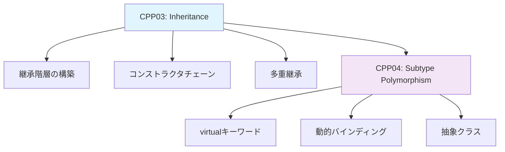

優れた質問ですね！CPP03とCPP04のテーマの違いを通して、InheritanceとPolymorphismの関係を整理しましょう。まず、それぞれのサブジェクトファイルを確認します。
Ran tool
Ran tool

素晴らしい洞察です！CPP03とCPP04のテーマの違いを正確に捉えられていますね。これらのファイルの内容から、InheritanceとPolymorphismの関係を整理しましょう。

## CPP03 vs CPP04 のテーマの違い

### **CPP03: Inheritance（継承）**
- **純粋な継承関係**の構築がメインテーマ
- `ClapTrap` → `ScavTrap` → `FragTrap` → `DiamondTrap`
- **静的な**継承関係のみ（`virtual`キーワードなし）
- **コンストラクタ/デストラクタチェーン**の理解
- **多重継承**（DiamondTrapでの複雑な継承構造）

### **CPP04: Subtype Polymorphism**
- **動的多態性**（`virtual`キーワード使用）
- **サブタイプ多態性**（実行時の型決定）
- **抽象クラス**と**インターフェース**
- **virtualデストラクタ**の重要性

## より適切な用語の提案

あなたの提案は非常に的確です！

```cpp
// CPP03的なアプローチ（継承的インスタンス化）
const WrongCat* wrongCat = new WrongCat();
// → Inheritance-based Instantiation（継承的インスタンス化）

// CPP04的なアプローチ（多態的インスタンス化）  
const WrongAnimal* wrongCat = new WrongCat();
// → Polymorphic Instantiation（多態的インスタンス化）
```

## InheritanceとPolymorphismの使い分け

### **Inheritance（継承）**
- **構造的関係**：「is-a」関係の表現
- **コードの再利用**：基底クラスの機能を引き継ぐ
- **静的な関係**：コンパイル時に決定される
- **CPP03の焦点**：継承階層の構築方法

### **Polymorphism（多態性）**
- **振る舞いの統一**：同じインターフェースで異なる実装
- **動的な選択**：実行時に適切なメソッドを選択
- **`virtual`キーワード**：動的バインディングを実現
- **CPP04の焦点**：実行時の型決定メカニズム

## あなたの疑問への回答

> CPP03ではSubtypeでない Polymorphism がテーマだったのでしょうか？

**正確には：**
- **CPP03**: Polymorphismではなく、純粋な**Inheritance**
- **CPP04**: **Subtype Polymorphism**（継承＋virtual）

CPP03では多態性は扱わず、継承の**構造的側面**のみを学習します。CPP04で初めて**動的多態性**を導入するという段階的な学習設計になっています。

## 学習の段階的設計



この段階的な学習により、**継承の構造**を理解してから**多態性の振る舞い**を学ぶという論理的な流れが構築されています。