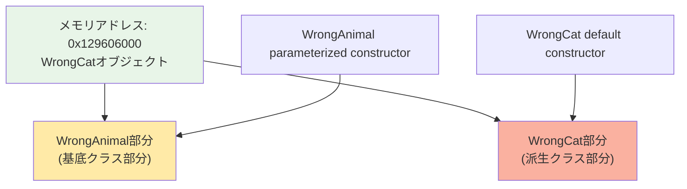

## 質問：
@ex00/ コンストラクタ、デストラクタの
`std::cout << "type: " << type << ", this: " << this << std::endl;
`では、３通りのインスタンス化全てで同じアドレスになり
`Animal parameterized constructor called
type: Cat, this: 0x12a0040c0`

`Cat default constructor called
type: Cat, this: 0x12a0040c0`
WrongAnimal parameterized constructor calledで呼ばれているWrongAnimal のコンストラクタで作られるインスタンスが一時オブジェクトだからですか？

優秀な観察ですね！しかし、これは一時オブジェクトが原因ではありません。実際のコードを確認して、継承における**コンストラクタチェーン**のメカニズムを説明しましょう。
Ran tool
Ran tool

## 答え：一時オブジェクトではありません

同じアドレスが表示される理由は**継承におけるコンストラクタチェーン**の正常な動作です。一時オブジェクトではありません。

## 継承における単一オブジェクトの構造

```cpp
WrongCat* wrongCat = new WrongCat();
```

この1行で作られるのは**1つのオブジェクト**ですが、内部的には以下の構造を持ちます：
Ran tool


## コンストラクタチェーンの実行順序

```cpp
WrongCat::WrongCat() : WrongAnimal("WrongCat")  // 注目：初期化リスト
```

**実行順序：**

1. **メモリ確保**: `0x129606000` に WrongCat オブジェクト用のメモリを確保
2. **基底クラス初期化**: `WrongAnimal("WrongCat")` が実行
   - `WrongAnimal parameterized constructor called`
   - `type: WrongCat, this: 0x129606000` 
3. **派生クラス初期化**: `WrongCat()` の本体が実行
   - `WrongCat default constructor called`
   - `type: WrongCat, this: 0x129606000`

## 重要なポイント

### **同じ `this` ポインタの理由**:
- **単一のオブジェクト**: メモリ上には1つのオブジェクトしか存在しない
- **部分的初期化**: 基底クラス部分と派生クラス部分を順次初期化
- **共通アドレス**: 両方のコンストラクタは同じメモリ領域を操作

### **一時オブジェクトとの違い**:
```cpp
// ❌ これが一時オブジェクトの例
WrongAnimal temp("WrongCat");  // 別のアドレスに作られる
WrongCat cat = temp;           // コピー（通常は異なるアドレス）

// ✅ 実際のコード：継承による単一オブジェクト
WrongCat* wrongCat = new WrongCat();  // 単一オブジェクト、同一アドレス
```

## 3つのインスタンス化方法で同じアドレスが表示される理由

どの方法でも：
1. `new WrongCat()` を実行
2. 同じコンストラクタチェーンが発生
3. 同じメモリレイアウトで初期化

**違いは実行時のポインタの型のみ**:
- `WrongCat* wrongCat = new WrongCat();` → WrongCat型ポインタ
- `WrongAnimal* wrongCat = new WrongCat();` → WrongAnimal型ポインタ

オブジェクト自体は同じ構造で同じ方法で作られます！rongAn